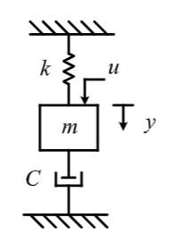
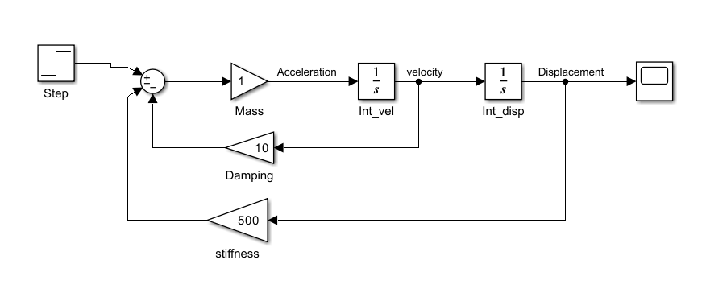
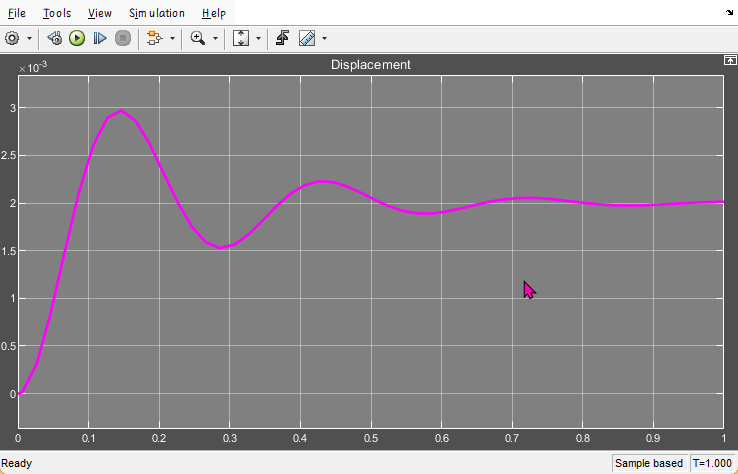

# Second-Order System Design using Simulink

Welcome to the Second-Order System Design repository! This repository contains Simulink models and documentation to design and analyze second-order systems.

## Table of Contents
- [Introduction](#introduction)
- [Images](#images)
- [Features](#features)
- [Software Requirements](#software-requirements)
- [Installation](#installation)
- [Usage](#usage)
- [Contributing](#contributing)
- [License](#license)
- [Acknowledgements](#acknowledgements)

## Introduction
The Second-Order System Design project demonstrates the principles and techniques for designing and analyzing second-order systems using Simulink. This educational project aims to provide an intuitive understanding of second-order system dynamics, stability, and response characteristics.

## Images
<p align="center">
  
</p>

<p align="center"><em>Figure 1: Diagram illustration of a typical second order system.</em></p>



*Figure 2: Diagram of a second-order system.*


*Figure 3: Graph showing the response of the second-order system.*

## Features
- Simulink models of various second-order systems
- Step response analysis
- Bode plot analysis
- Root locus analysis
- Adjustable system parameters for experimentation
- Comprehensive documentation and examples

## Software Requirements
- MATLAB (R2020a or later)
- Simulink (Add-on for MATLAB)
- Control System Toolbox (Add-on for MATLAB)

## Installation
Clone this repository to your local machine:
```bash
git clone https://github.com/sployal/Second_ordrer_system_simulink.git
